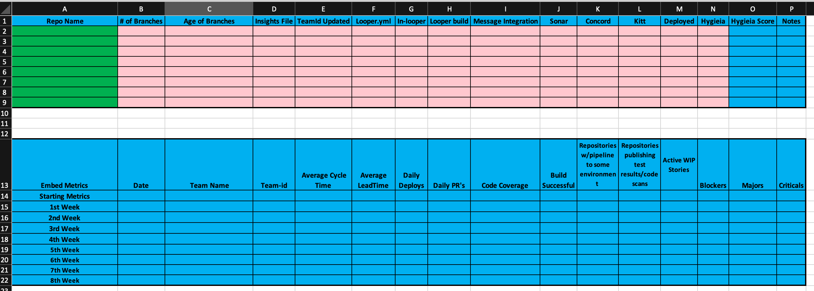

Building an excel [**Repository
Reporting**](../../assets/Repo-Report-Excel.xlsx) file is a way the DevOps Dojo
team can get a quick view into the overall health of a teams repositories and
processes of the teams we embed with. We wanted to pass this information to everyone
so they can also use this to measure your own teams overall health.

## Recommended Practices

- [Repository Report Template](../../assets/Repo-Report-Excel.xlsx)
- Create a new tab in Excel file each time you update to be able to track progress.

## Tips

- Conditional Formatting Columns
  - Blank columns make red.
  - Number of branches equal 1 (trunk) format green. # of Branches > 1 format
    to be red.
  - Age of branches(just trunk) format to be green. If more than trunk put time
    since latest branch was created make red.
  - Yes format green. No format red.
  - Pass format green. Failed format red.
  - Score format green. No Score format red.

## Value

- Finds issues with branching strategy.
- Finds next steps to improve individual repository's pipeline.
- Finds next steps for having accurate data for team metrics.

## Acceptance Criteria

- All columns will be green.

---

_[Back To Bifrost](../../index.html)_


